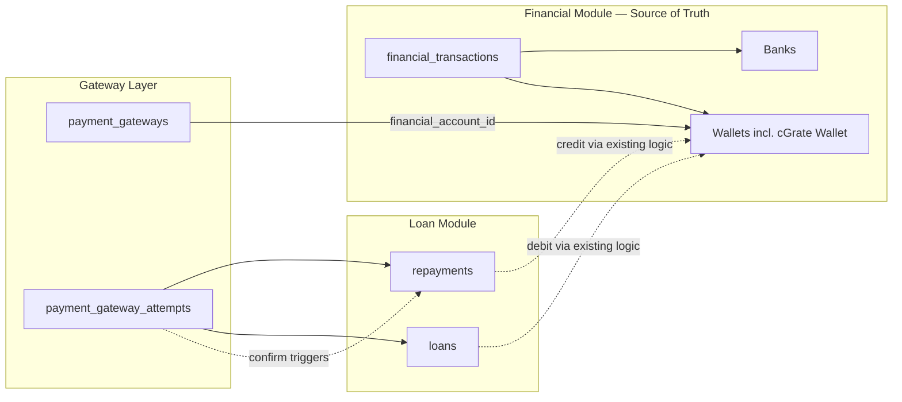

# Gateway Attempt Records & Core Finance Boundaries

Architecture date: 2026-07-02 (final)  
Gateway architecture: [PAYMENT-GATEWAY-ARCHITECTURE.md](./PAYMENT-GATEWAY-ARCHITECTURE.md)  
Status: **Architecture and documentation only — no implementation**

---

## Gateway Integration Does Not Replace Core Finance

FineEdge's **financial module** (`Bank`, `Wallet`, `FinancialTransaction`, balance management) remains the **source of truth for all balances and accounting**.

The gateway enhancement:

- Links each provider to an **existing** financial account (e.g. **cGrate Wallet**)
- Confirms external payment success/failure
- Hands off to **existing** repayment/disbursement services for loan updates and finance posting

The gateway **never** maintains its own balances or calls `updateBalance()` directly.

```text
Existing Loan System
        │
        ▼
Existing Financial Module
        │
        ▼
Gateway Integration Layer
        │
        ▼
External Provider (cGrate, etc.)
```

---

## 1. Purpose

Document how gateway attempt records relate to existing business and financial records, including the **gateway-to-financial-account mapping**.

---

## 2. Financial module (unchanged ownership)

| Entity | Role |
|--------|------|
| `banks` | Company bank accounts, opening balances, `updateBalance()` |
| `wallets` | Company wallets incl. **cGrate Wallet**, Cash, MTN, Airtel |
| `cash_registers` | Cash positions |
| `financial_transactions` | Income, expense, transfer with approval |
| `repayments.received_via_*` | Which account received a repayment |
| `loans.disbursed_via_*` | Which account funded a disbursement |

Operations loads cGrate float by updating **cGrate Wallet** balance through existing wallet admin — same as any other wallet.

---

## 3. Gateway financial account link

### 3.1 `payment_gateways` fields

| Field | Purpose |
|-------|---------|
| `financial_account_type` | `bank` or `wallet` |
| `financial_account_id` | FK to `banks.id` or `wallets.id` |
| `financial_account_active` | Guard; linked account must be active |

Only pre-existing accounts are selectable. No parallel account system.

### 3.2 Example mappings

| Gateway | Type | Account |
|---------|------|---------|
| cGrate | wallet | cGrate Wallet |
| CyberSource (future) | bank | Stanbic Settlement Account |
| Manual | wallet | Cash Wallet |

### 3.3 cGrate Wallet

- Created via **existing** `/admin/wallets` UI before go-live
- Represents funds available with cGrate provider
- Credited on successful collection; debited on successful disbursement
- Balance visible in existing financial reports — not a gateway-admin-only balance

---

## 4. Gateway attempt records

### 4.1 `payment_gateway_attempts`

Integration log linked to `repayment_id` or `loan_id`. Does not store account balances.

### 4.2 What posts to financial accounts

| Event | Who posts | Account |
|-------|-----------|---------|
| Manual repayment approve | `Admin\RepaymentController::approve()` | Admin-selected bank/wallet/cash |
| Integrated repayment confirm | `finalizeIntegratedRepayment()` + **shared finance helper** | Gateway linked account (cGrate Wallet) |
| Manual disburse | `LoanController::disburse()` | Admin-selected source |
| Integrated disburse confirm | **Shared disburse helper** | Gateway linked account (cGrate Wallet) |

**Single implementation rule:** Extract credit logic from `approve()` and debit logic from `disburse()` into shared services. Integrated and manual paths call the same helpers.

---

## 5. Collection flow (financial boundaries)

```text
Customer → cGrate → gateway attempt confirmed
  → RepaymentProcessingService.finalizeIntegratedRepayment()
  → Shared finance posting: credit cGrate Wallet (Wallet::updateBalance)
  → Set repayments.received_via_type = wallet, received_via_id = cGrate Wallet id
  → applyRepaymentToLoans() + LoanRepaymentLedgerService
  → Notification / receipt
```

Gateway code stops at `confirmed`. All balance and loan changes happen in existing services.

---

## 6. Disbursement flow (financial boundaries)

```text
Gateway payout confirmed
  → Shared loan disbursement completion (extracted from LoanController::disburse)
  → Shared finance posting: debit cGrate Wallet
  → Loan::applyDisbursementCompleted()
  → Set loans.disbursed_via_type = wallet, disbursed_via_id = cGrate Wallet id
```

---

## 7. Relationship diagram



---

## 8. Reconciliation (gateway scope)

- Match attempt status to provider API
- Admin recheck / retry
- View gateway-linked account movements via **existing** financial reports and `repayments.received_via_*` / wallet transaction history

**Not in scope:** separate gateway balance ledger, settlement file import.

---

## 9. Implementation tasks (finance integration)

| Task | Notes |
|------|-------|
| Create cGrate Wallet | Ops via existing wallets admin |
| Add financial account FK to `payment_gateways` | Seed cGrate → cGrate Wallet |
| Extract `RepaymentFinancePostingService` | From `approve()` credit block |
| Extend `finalizeIntegratedRepayment()` | Call shared posting with gateway linked account |
| Extract `LoanDisbursementService` | From `disburse()` debit block |
| Wire integrated disburse | Debit gateway linked account |

---

## 10. Related documents

- [PAYMENT-GATEWAY-ARCHITECTURE.md](./PAYMENT-GATEWAY-ARCHITECTURE.md) — §4 gateway accounts
- [GATEWAY-ADMINISTRATION-MODULE.md](./GATEWAY-ADMINISTRATION-MODULE.md) — linked account UI
- [CGRATE-LOAN-REPAYMENT-ROADMAP.md](./CGRATE-LOAN-REPAYMENT-ROADMAP.md)
