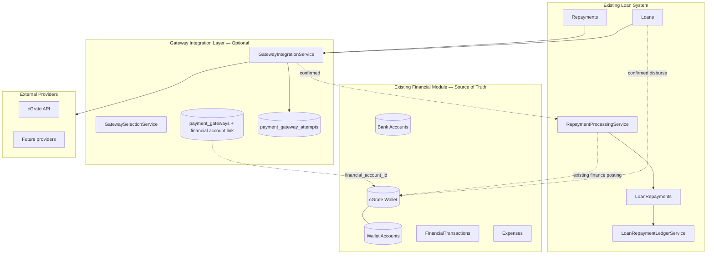

# FineEdge Payment Gateway Architecture

Architecture date: 2026-07-02 (final)  
System: FineEdge (`/var/www/personal/finedge-revamp`)  
Reference provider: ZAQA cGrate (`/var/www/html/zaqa-portal`) — production-certified for collections  
Status: **Architecture and documentation only — no implementation**

---

## Document map

| Document | Scope |
|----------|-------|
| **This document** | Lightweight gateway integration layer — selection, providers, failover |
| [FINANCIAL-TRANSACTION-ARCHITECTURE.md](./FINANCIAL-TRANSACTION-ARCHITECTURE.md) | Gateway attempt records; how they link to existing business records |
| [GATEWAY-ADMINISTRATION-MODULE.md](./GATEWAY-ADMINISTRATION-MODULE.md) | Operations UI for gateways and attempts |
| [CGRATE-INTEGRATION-ANALYSIS.md](./CGRATE-INTEGRATION-ANALYSIS.md) | ZAQA reference; cGrate as first provider |
| [CGRATE-LOAN-REPAYMENT-ROADMAP.md](./CGRATE-LOAN-REPAYMENT-ROADMAP.md) | Implementation phases for collections |
| [CGRATE-DISBURSEMENT-ROADMAP.md](./CGRATE-DISBURSEMENT-ROADMAP.md) | Implementation phases for disbursements |

---

## Gateway Integration Does Not Replace Core Finance

FineEdge **already has** financial modules that manage:

- Bank accounts and wallet accounts
- Opening balances
- Loan take-outs / disbursements
- Repayments
- Expenses
- Balance updates
- Manual repayment flows
- Manual disbursement flows

**The gateway enhancement is optional and additive.** It must **not** replace, duplicate, or interfere with those modules.

| Principle | Meaning |
|-----------|---------|
| **Existing loan/finance modules = source of truth** | `Repayment`, `Loan`, `LoanRepayment`, `Bank`, `Wallet`, `FinancialTransaction` remain authoritative |
| **Gateway layer = external payment connector** | Talks to cGrate and future providers; stores attempts and status only |
| **Gateway financial account** | Each gateway maps to an **existing** `Bank` or `Wallet` — e.g. cGrate Wallet |
| **Manual flow = always available fallback** | System works with all gateways disabled |

**The financial module remains the source of truth for all balances.** The gateway layer provides another way for money to enter or leave existing financial accounts. It never maintains its own balances.

**The gateway confirms money movement. Existing business services apply the business and financial effect** (loan update + credit/debit linked account via existing finance logic).

**Explicitly out of scope:**

- A separate gateway balance ledger or float/clearing system
- Gateway-direct calls to `updateBalance()` or `FinancialTransaction::create()`
- Settlement file imports (deferred)
- Replacing `banks`, `wallets`, or `financial_transactions`

---

## 1. Vision

FineEdge adds a **lightweight gateway integration layer** so loan repayments and disbursements can optionally use external providers (cGrate first). The layer answers only:

1. Which account are we collecting from / sending to? (reference data on the business record)
2. Which gateway is being used?
3. What is the provider reference and status?

cGrate is the **first provider** because ZAQA production validated SOAP collections. It lives in the provider layer — never in loan or finance services.

```text
Existing Loan System
        │
        ▼
Existing Financial Module
(Bank Accounts / Wallets / Accounting)
        │
        ▼
Gateway Integration Layer
(cGrate, CyberSource, Future Providers)
        │
        ▼
External Payment Provider
```

---

## 2. Layered architecture (final)



Every gateway that moves money links to an existing `Bank` or `Wallet`. The **cGrate Wallet** is a normal wallet record — Operations loads float via existing account management. Gateway transactions credit or debit that wallet through **existing** repayment/disbursement finance logic, not gateway code.

---

## 3. Layer responsibilities

| Layer | Owns | Must NOT own |
|-------|------|--------------|
| **Loan modules** | Repayments, loan balances, schedules, allocations | Provider APIs, wallet balances |
| **Financial module** | `Bank`, `Wallet`, balances, `FinancialTransaction`, expenses | Provider SOAP/REST, gateway attempts |
| **Gateway integration** | Provider I/O, attempts, status, selection, failover | Balance updates, loan math, ledger entries |
| **Provider adapters** | One provider's API + code mapping | Accounting, balance changes |

**Critical rule:** The gateway never calls `updateBalance()` or creates `FinancialTransaction` records. It passes confirmation to existing services that already perform finance posting for manual flows.

---

## 4. Gateway financial account integration

### 4.1 Concept

Every payment gateway that moves money must link to an **existing** financial account in the mature finance module:

```text
Financial Accounts (existing admin UI)

Bank Accounts          Wallet Accounts
-------------          ---------------
Stanbic Bank           Cash Wallet
Zanaco Bank            MTN Wallet
                       Airtel Wallet
                       cGrate Wallet    ← NEW wallet; same model as others
```

The **cGrate Wallet** represents funds held with the cGrate provider. Operations loads balance into cGrate by updating the cGrate Wallet through existing wallet management — the gateway platform does not manage balances.

### 4.2 Gateway-to-account mapping

Each `payment_gateways` row links to one financial account:

| Gateway | Account type | Account | Use |
|---------|--------------|---------|-----|
| cGrate | Wallet | cGrate Wallet | Collections credit + disbursements debit |
| CyberSource (future) | Bank | Stanbic Settlement Account | Card collections |
| Manual | Wallet | Cash Wallet | Manual cash repayments |

Collections and disbursements on the same gateway may share one account (cGrate) or use separate linked accounts if configured later.

### 4.3 Required gateway configuration fields

Extend `payment_gateways` (or `config` JSON with FKs):

| Field | Type | Notes |
|-------|------|-------|
| `financial_account_type` | enum | `bank`, `wallet` |
| `financial_account_id` | bigint FK | Must exist in `banks` or `wallets` |
| `financial_account_active` | boolean | Denormalised guard; account must be `is_active` |

**Rules:**

- Only accounts that already exist in the financial module are selectable
- Do not create a parallel account system
- Admin selects linked account in Gateway Administration (read-only balance display from finance module)
- Changing linked account is audited; does not retroactively alter past postings

### 4.4 Gateway account rules (where money resides)

| Flow | Gateway | Financial account |
|------|---------|-------------------|
| Manual cash repayment | Manual | Cash Wallet (admin selects at approve) |
| Manual bank deposit | Manual | Selected Bank Account |
| cGrate collection | cGrate | cGrate Wallet (from gateway link) |
| cGrate disbursement | cGrate | cGrate Wallet (from gateway link) |
| Future provider | Mapped gateway | Configured Bank or Wallet |

---

## 5. What the gateway layer stores

### 5.1 `payment_gateways` (registry)

Provider configuration: code, capabilities, status, priority, health, **financial account link** (§4.3).

### 5.2 `payment_gateway_attempts` (integration log)

Technical record per provider interaction — **not** a replacement for `repayments` or `loans`.

| Stores | Does not store |
|--------|----------------|
| Gateway code, provider refs, status | Wallet/bank running balances |
| Request/response/callback payloads | Loan allocation breakdown |
| Retry/failover metadata | Duplicate `financial_transactions` |

### 5.3 Links to existing business records

| Operation | Business record (source of truth) | Gateway attempt links via |
|-----------|--------------------------------|---------------------------|
| Collection | `repayments` | `repayment_id` |
| Disbursement | `loans` | `loan_id` |

`repayments.external_reference` / `external_transaction_id` continue to hold provider refs for business visibility. Gateway attempts hold the full technical audit trail.

---

## 6. Payment methods vs gateways

| Concept | Who chooses | Examples |
|---------|-------------|----------|
| **Payment method** | Customer / admin UI | Mobile Money, Bank Transfer, Card, Cash |
| **Gateway** | `GatewaySelectionService` | cGrate, CyberSource, Manual (no API) |

Repayment modules pass **payment method** — never `gateway_code`. Gateway selection uses **capabilities**, not hardcoded provider names.

---

## 7. Gateway layer components

| Component | Responsibility |
|-----------|----------------|
| `PaymentGatewayInterface` | `collectMoney`, `queryStatus`, `handleCallback`, `healthCheck` |
| `DisbursementGatewayInterface` | `sendMoney`, `queryStatus`, `handleCallback`, `healthCheck` |
| `GatewayManager` | Resolve adapter by code from registry |
| `GatewayRegistry` | Code → adapter class map |
| `GatewaySelectionService` | Method + capabilities + health + priority |
| `GatewayHealthService` | Heartbeat, circuit breaker states |
| `GatewayConfigurationService` | Merge env secrets + DB dynamic config |
| `GatewayIntegrationService` | Orchestrate attempts, jobs, callbacks — **no loan math** |

**Gateway interfaces use neutral DTOs** — no `Repayment` or `Loan` types inside provider adapters (only IDs/refs in orchestration).

---

## 8. Gateway capabilities

Selection filters on capability flags, not provider name:

```
collections, disbursements, refunds (future), reversals (future),
callbacks, polling, realtime_status,
payment_methods: [mobile_money, bank_transfer, debit_card, ...]
```

---

## 9. Account selection (collections & disbursements)

### 8.1 Collections — store and show on attempt + repayment

| Field | Source |
|-------|--------|
| Customer phone / source account | `repayments.phone_number`, customer profile |
| Payment method | `channels` / `Channel.type` |
| Gateway used | `payment_gateway_attempts.gateway_code` |
| Internal reference | Attempt `internal_reference`; `repayments.repayment_number` |
| Provider reference | Attempt `provider_reference` → `repayments.external_reference` |
| Status | Attempt status → drives `repayments.status` via existing services |

### 8.2 Disbursements — store and show on attempt + loan

| Field | Source |
|-------|--------|
| Destination bank/wallet / phone | `loans.disbursement_*` fields (existing) |
| Disbursement method | `loans.disbursement_channel_type` / `channel_id` |
| Gateway used | Attempt `gateway_code` |
| Internal reference | Attempt `internal_reference`; `loans.disbursement_reference` |
| Provider reference | Attempt `provider_transaction_id` |
| Status | Attempt status; `loans.disbursement_status` updated by **existing** disburse logic |

**Financial posting stays in existing services** — see §9.

---

## 10. Safeguard — where existing system updates records today

Before implementation, gateway integration **must call these paths** — not parallel logic.

### 10.1 Loan repayment balances

| Step | Location |
|------|----------|
| Create repayment record | `Customer\RepaymentController`, `Admin\RepaymentController` |
| Apply payment to loans | `RepaymentProcessingService::applyRepaymentToLoans()` |
| Principal/interest/fee split | `Loan::calculateRepaymentAllocation()` |
| Schedule update | `Loan::updatePaymentSchedule()` |
| Ledger sync | `LoanRepaymentLedgerService::syncLoanLedger()` |
| Integrated finalize | `RepaymentProcessingService::finalizeIntegratedRepayment()` |
| Manual admin approve | `Admin\RepaymentController::approve()` → `applyRepaymentToLoans()` |
| Bulk import | `Admin\BulkRepaymentController` → `syncLoanLedger()` |
| Refunds | `LoanRepaymentRefundService` → `syncLoanLedger()` |

**Gateway on confirm → `finalizeIntegratedRepayment()` + shared finance posting to gateway linked account** (same helper as manual approve).

### 10.2 Loan disbursement status

| Step | Location |
|------|----------|
| Set pending on approval | `LoanApplicationController`, `LoanController`, `CollateralLoanController` |
| Manual disburse complete | `Admin\LoanController::disburse()` → `Loan::applyDisbursementCompleted()` |
| Active portfolio rules | `Loan::scopeDisbursed()`, `isDisbursed()` |

**Gateway on confirm → shared disburse completion debiting gateway linked account** (same helper as manual `disburse()`).

### 10.3 Bank / wallet balances

| Step | Location |
|------|----------|
| Manual repayment credit | `Admin\RepaymentController::approve()` → `Bank/Wallet/CashRegister::updateBalance(credit)` |
| Manual disbursement debit | `Admin\LoanController::disburse()` → `source->updateBalance(debit)` |
| Bulk repayment | `BulkRepaymentController` → `updateBalance(credit)` |
| Income/expense/transfer | `FinancialTransaction::create()` → `updateBalances()` |
| Transfers | `Admin\TransferController` |

**Gateway must not call `updateBalance()` directly.** Integrated flows pass `financial_account_type` + `financial_account_id` from gateway config into existing finance posting helpers.

### 10.4 Repayment records

| Record | Created by |
|--------|------------|
| `repayments` | Customer/admin repayment controllers |
| `loan_repayments` | `RepaymentProcessingService::applyPaymentToLoan()` |

### 10.5 Disbursement records

| Record | Updated by |
|--------|------------|
| `loans.disbursement_*` | Origination flows, `LoanPaymentDetailsService` |
| `loans.disbursed_at`, `disbursement_status` | `Loan::applyDisbursementCompleted()` |
| `loans.disbursed_via_*` | `LoanController::disburse()` |

### 10.6 Expenses

| Record | Location |
|--------|----------|
| `financial_transactions` (expense) | Admin financial transaction controllers |
| Balance impact | `FinancialTransaction::updateBalances()` |

Gateway integration does not touch expenses in Phase 1.

---

## 11. Collection flow (with financial account)

```text
Customer
  ↓
cGrate (external)
  ↓
Gateway confirms payment → attempt = confirmed
  ↓
RepaymentProcessingService.finalizeIntegratedRepayment()     [existing — extended]
  ↓
Existing finance posting (shared with manual approve)        [existing pattern]
  ↓
Credit linked financial account (cGrate Wallet)                [Wallet::updateBalance credit]
  ↓
applyRepaymentToLoans() + LoanRepaymentLedgerService         [existing]
  ↓
repayments.received_via_type/id = wallet + cGrate Wallet id  [existing fields]
  ↓
Receipt / notification                                       [existing]
```

**Implementation note:** Today `finalizeIntegratedRepayment()` applies loans but does not credit a wallet; manual `approve()` does both. Phase P1 must **extract shared finance posting** from `Admin\RepaymentController::approve()` so integrated and manual paths use **one** implementation. Gateway supplies the linked account from `payment_gateways.financial_account_*` — gateway code never calls `updateBalance()` directly.

For **manual** repayments (gateways disabled):

```text
  → Repayment pending → Admin\RepaymentController::approve()
  → admin selects bank/wallet/cash + credit + applyRepaymentToLoans()   [unchanged]
```

---

## 12. Disbursement flow (with financial account)

```text
Admin approves loan
  ↓
Gateway sends payout request (when automated)
  ↓
cGrate transfers money
  ↓
Gateway confirms → attempt = confirmed
  ↓
Existing loan disbursement completion logic                  [LoanController::disburse or extracted service]
  ↓
Existing finance posting
  ↓
Debit linked financial account (cGrate Wallet)               [Wallet::updateBalance debit]
  ↓
Loan::applyDisbursementCompleted()                           [existing]
  ↓
loans.disbursed_via_type/id = wallet + cGrate Wallet         [existing fields]
```

For **manual** disbursement (`DISBURSEMENT_TYPE=manual` or all gateways off):

```text
  → Admin\LoanController::disburse() — admin selects source bank/wallet   [unchanged]
```

Automated disburse must debit the **gateway linked account** (cGrate Wallet), not an admin-picked source — using the same `updateBalance(debit)` path manual disburse already uses.

---

## 13. Single accounting implementation rule

There must **never** be two different accounting implementations.

| Flow | Entry point | Finance posting |
|------|-------------|-----------------|
| Manual repayment approve | `Admin\RepaymentController::approve()` | Credit selected bank/wallet/cash |
| Integrated repayment confirm | `finalizeIntegratedRepayment()` | Credit gateway linked account (same helper) |
| Manual disburse | `LoanController::disburse()` | Debit selected bank/wallet |
| Integrated disburse confirm | Shared disburse completion service | Debit gateway linked account (same helper) |

**Proposed (implementation):** `RepaymentFinancePostingService` / reuse within `RepaymentProcessingService` — extracts credit logic from `approve()`. `LoanDisbursementService` — extracts debit logic from `disburse()`. Gateway listeners pass `financial_account_type` + `financial_account_id` from gateway config.

---

## 14. Manual flows remain first-class

| Scenario | Behaviour |
|----------|-----------|
| All gateways `disabled` | Manual repayment approve + manual disburse work as today |
| `channel.is_repayment_integrated = false` | Customer submission → pending → admin approve |
| `DISBURSEMENT_TYPE=manual` | No automated payout |
| Gateway initiation fails | Fall back to manual path or retry — never block loan management |

`ManualGateway` adapter = no external API; attempt record optional for audit only.

---

## 15. Gateway health & failover

Unchanged principles — selection skips `offline` / `maintenance` / `disabled`:

| Scenario | Auto backup? |
|----------|--------------|
| Initiation fails immediately | Yes, if backup configured |
| Pending at provider | **Never** auto-switch |
| Failed / expired | Explicit retry — new attempt |
| Completed | Block duplicates |

---

## 16. Provider certification

| Level | Production use |
|-------|----------------|
| `production_certified` | Allowed (cGrate collections via ZAQA) |
| `sandbox_certified` | Staging only |
| `testing` / `planned` | Dev / hidden |
| `deprecated` | No new attempts |

---

## 17. Event-driven hook (lightweight)

```
GatewayAttemptConfirmed
  → FinalizeRepaymentListener
      → finalizeIntegratedRepayment() + shared finance posting (credit linked account)
  → FinalizeDisbursementListener
      → shared disburse completion + finance posting (debit linked account)
```

Listeners invoke **existing** services only. Gateway event carries `payment_gateway_id` so listener can resolve linked financial account.

---

## 18. Security

- Credentials in env / encrypted storage — not in DB config JSON
- Per-provider callback token + IP allowlist
- RBAC for gateway admin vs repayment/disburse permissions
- Separate FineEdge credentials from ZAQA production

---

## 19. Recommended folder structure

```
app/PaymentGateway/                    # Lightweight — not a full "platform"
  Contracts/                           PaymentGatewayInterface, DisbursementGatewayInterface
  DTOs/                                CollectionRequest, GatewayResult (neutral)
  Enums/                               GatewayAttemptStatus, PaymentMethod (reference)
  Services/
    GatewayIntegrationService.php      Orchestration only
    GatewaySelectionService.php
    GatewayManager.php
    GatewayRegistry.php
    GatewayHealthService.php
    GatewayConfigurationService.php
  Providers/
    CGrate/
    Manual/
  Transports/
    SoapTransport.php
  Jobs/
    DispatchCollectionPromptJob.php
    QueryGatewayAttemptJob.php
  Models/
    PaymentGateway.php
    PaymentGatewayAttempt.php
    PaymentGatewayLog.php
  Http/Controllers/Webhooks/
    GatewayCallbackController.php
  Listeners/                           Optional — call existing services
    FinalizeRepaymentListener.php

app/Services/                          # Existing — finance posting ownership stays here
  RepaymentProcessingService.php       # + shared finance posting (extracted from approve)
  LoanRepaymentLedgerService.php
  LoanDisbursementService.php          # Future extract from LoanController::disburse
```

---

## 20. Implementation priority

| Phase | Focus |
|-------|-------|
| P0 | Docs ✅ |
| P0b | Create **cGrate Wallet** via existing Wallets admin (ops setup) |
| P1 | Gateway tables incl. financial account link + cGrate provider |
| P1 | Extract shared finance posting; wire integrated confirm to credit cGrate Wallet |
| P2 | Gateway admin UI incl. linked account selector + read-only balance |
| P3 | Second provider with different mapped account |
| D1+ | Disburse debit cGrate Wallet via shared disburse service |

---

## 21. Final design direction

```text
Existing Loan System = Business source of truth
Existing Financial Module = Balance / accounting source of truth
Gateway Layer = External connector into existing financial accounts
Manual Flow = Always available fallback
cGrate Wallet = Normal wallet; gateway-linked; credited/debited by existing finance logic
```

Do not over-engineer separate settlement systems. Gateway float is managed through existing wallet administration.

---

## 22. Automatic Gateway Disbursement on Approval

When a loan is approved, the system may automatically initiate gateway disbursement based on **Gateway Routing** configuration — not `.env` flags or `DISBURSEMENT_TYPE`.

### Control surface

| Setting | Table / UI | Effect |
|---------|------------|--------|
| Route enabled | `payment_gateway_routes.enabled` | Route must be enabled for auto or manual gateway resolution |
| Automatic processing | `payment_gateway_routes.auto_process` | When true, approval triggers auto-disburse attempt |
| Assigned gateway | `payment_gateway_routes.payment_gateway_id` | Gateway used for the route |

Configure via **Admin → Configuration → Gateway Routing**.

### Destination → route mapping

| Loan destination | Route key |
|------------------|-----------|
| Mobile wallet | `wallet_disbursement` |
| Bank account | `bank_disbursement` |
| Cash / unsupported | Auto-disburse skipped — manual disbursement only |

### Service flow

`AutomaticLoanDisbursementService` runs **after** approval succeeds in `ApprovalController::approveLoan()` and API `LoanController::approve()`. It:

1. Resolves the matching disbursement route from loan destination
2. Skips if route disabled or `auto_process` is false
3. Validates route readiness via `PaymentGatewayRouteService::resolveRouteForDisbursement()`
4. Calls existing `GatewayIntegrationService::initiateDisbursement()` when ready
5. Returns structured result — **approval is never rolled back** on auto-disburse failure

### Outcomes

| Outcome | Loan status | disbursement_status | Gateway attempt |
|---------|-------------|---------------------|-----------------|
| No auto route / auto off | approved | pending | none |
| Auto initiated | approved | processing | created + job queued |
| Auto skipped (not ready) | approved | pending | none — manual fallback available |
| Payout confirmed later | active | completed | wallet debited once via existing confirm path |

**Wallet/bank is debited only after confirmed payout** — same rule as manual gateway disbursement.
